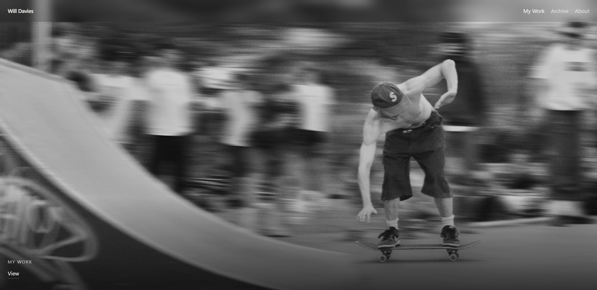
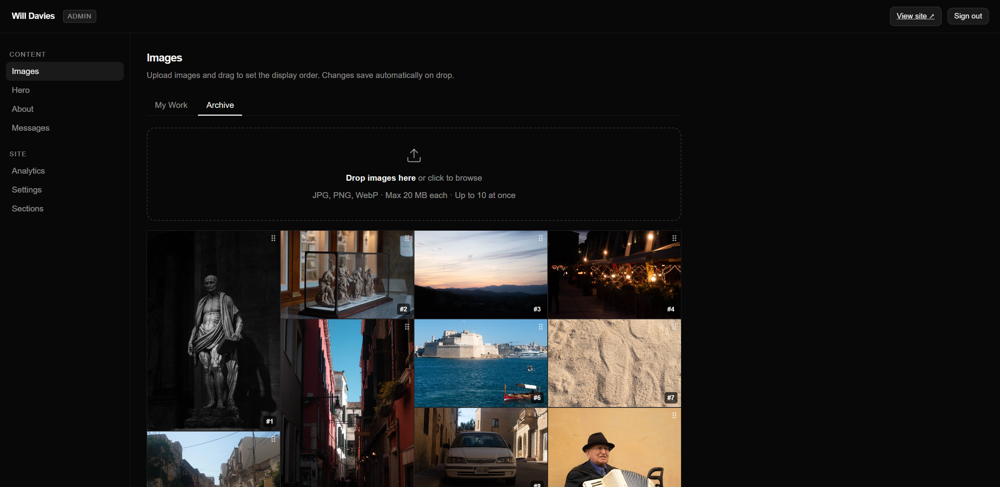

# Photography Portfolio

[](https://github.com/will1855/PhotographyPortfolio/actions/workflows/ci.yml)
[](https://nodejs.org/)
[](https://playwright.dev/)

A personal photography portfolio built to present my work in a clean, image-led format, serving as a full-stack technical case study.

Live site: https://willdaviesphoto.co.uk


## Overview

This is my personal photography portfolio site. I wanted the site to feel simple, cinematic, and focused on the images rather than heavy UI. It includes separate sections for selected work and archive images, with an admin area for managing content.

## Screenshots



## Features

- Full-screen hero image
- Image-led gallery layout
- Separate “My Work” and “Archive” sections
- About page
- Admin area for uploading and ordering images
- Hero image/content management
- Basic analytics/messages/settings sections
- Responsive layout for different screen sizes

---

## System Architecture

The site combines server-rendered HTML structures (for fast first paint times) with an in-page client router (for fast subsequent page switches without full reloading).

```mermaid
graph TD
    subgraph Client [Browser Tier]
        DOM[Dynamic DOM Getters]
        ESM[Native ES Modules]
        SW[PWA Service Worker Cache]
        RTR[SPA Client-Side Router]
        
        ESM --> RTR
        RTR --> DOM
    end

    subgraph AppServer [Application Tier - Express]
        RL[IP Rate Limiter]
        JWT[Stateless JWT Cookie Auth]
        TC[In-Memory Raw Template Cache]
        
        RL --> JWT
        JWT --> TC
    end

    subgraph Storage [Database & Object Storage Tier - Supabase]
        DB[(PostgreSQL - Metadata & Analytics)]
        S3_Full[Supabase S3 Bucket - High-Res WebP Originals]
        S3_Thumb[Supabase S3 Bucket - Sharp Grid WebP Thumbnails]
    end

    %% Communications
    Client <-->|HTTP Request / JSON APIs| AppServer
    AppServer <-->|SQL Queries| DB
    AppServer <-->|Signed URL Resolver| S3_Full
    AppServer <-->|Signed URL Resolver| S3_Thumb
```



---

## Technical Details & Optimizations

### 1. Touch Gestures & Lightbox Performance
To keep mobile swipes and zoom gestures highly responsive, the full-screen lightbox separates rendering and data loading:
* **Immediate CSS Transforms**: Swipes are applied instantly as CSS transforms on the active slide.
* **Debounced High-Resolution Loading**: Heavy high-resolution images are only requested after a swipe motion has fully stopped (using a 480ms debounce). This prevents heavy image decoding threads from blocking the browser's UI thread.
* **Preloading Adjacent Slides**: Slides immediately before and after the active slide are fetched in the background as smaller, lightweight WebP files.

### 2. Preventing Cumulative Layout Shift (CLS)
To keep the grid stable while images load:
* **Aspect-Ratio Calculations**: Before rendering, the frontend queries image dimensions stored in the Supabase database. These dimensions are used to calculate the exact grid column and height layouts.
* **Explicit CSS Sizing**: Grid containers are styled with explicit aspect ratios, ensuring the browser reserves the exact space before the image files start downloading.
* **Click Coordinate Matching**: When opening the lightbox, the coordinates of the clicked thumbnail are matched dynamically so that the expanding animation scales smoothly from the original grid item.

### 3. Responsive Image Sizing & Preloading
* **Screen-Aware Delivery**: Mobile viewports ($\le 700\text{px}$) are served $600\text{px}$ WebP thumbnails, while desktop displays load $1200\text{px}$ WebP versions.
* **Targeted Preloading**: The application triggers specific preload headers on navigation hover events. By mirroring the browser's `imagesrcset` rules, the browser pre-fetches the specific image size it needs, preventing redundant file downloads.

### 4. Server-Side Template Caching
To minimize disk reads:
* **Single-Read Caching**: Main templates (`index.html`, `about.html`) are read from the disk once when the Express server starts and are cached in memory.
* **Fast Token Injection**: Dynamic SEO tags and metadata are injected directly into the cached in-memory string on each request, reducing server response times (TTFB) without losing custom page metadata.

---

## Security Features

* **Stateless JWT Cookie Authentication**: Admin operations are secured using JSON Web Tokens (JWT). The token is stored in a secure, `HttpOnly`, `Secure` (in production), and `SameSite=Lax` cookie, which prevents client-side scripts from reading it.
* **Timing Attack Prevention**: Password verification checks use Node's `crypto.timingSafeEqual` function. This makes sure that execution times are identical regardless of the password's length or correct prefix, preventing timing analysis attacks.
* **IP Rate Limiting**: The login endpoint is protected with a rate limiter (maximum of 5 login attempts per 15 minutes per IP) to prevent brute-force attacks.

---

## Admin Tools

The custom admin area lets me upload new photographs, reorder them in the gallery, and manage general site content directly. This makes it easy to update my portfolio and refresh the landing page image from any device without needing to edit the source code or redeploy.



---

## Tech Stack

This project is built using:

- **JavaScript**: Core programming language for both client-side interactivity and server-side logic.
- **Node.js & Express**: Powers the backend routing, authentication middleware, API endpoints, and server functionality.
- **HTML/CSS**: Standard markup and custom CSS for a clean, responsive dark-themed grid.
- **Supabase**: Handles the PostgreSQL database for image metadata and messages, and provides storage buckets for the photography files.
- **JSON Web Tokens (JWT)**: Secures the admin dashboard routes with stateless session cookies.
- **Sharp**: Generates image thumbnails on the fly during uploads.
- **Vercel**: Handles hosting and deployment.
- **Playwright**: Automates end-to-end testing to verify page layouts and navigation.

---

## Automated Quality Assurance (E2E Testing)

This repository includes a comprehensive end-to-end integration and security test suite using **Playwright**.

### Local Test Execution
To run the automated E2E tests locally on your machine:

1. **Install dependencies**:
   ```bash
   npm install
   npx playwright install chromium
   ```

2. **Execute the tests**:
   ```bash
   # Headless execution
   npm test
   
   # Visual UI interactive mode
   npx playwright test --ui
   ```

The local test runner will automatically start the Express server on port `3000`, run all layout, SPA, and security assertion suites, and tear down the server cleanly on completion.

---

## Continuous Integration (CI/CD)

Every push or pull request to the `main` branch automatically triggers the continuous integration workflow in GitHub Actions (`.github/workflows/ci.yml`):
1. Spins up an isolated `ubuntu-latest` runner.
2. Installs dependencies and downloads Playwright headless Chromium layers.
3. Sets up mock environment variables to satisfy server-side startup validation without exposing production database credentials.
4. Executes E2E tests, verifying SPA routing, contact forms, page assets, and admin portal security.
5. In case of failure, automatically packages screenshots/videos and uploads them as workflow build artifacts to streamline debugging.

---

## Notes

This portfolio is a personal project that I am refining as I add more photography and improve the portfolio presentation. Future updates will focus on fine-tuning responsive layouts and optimizing image loading performance.
