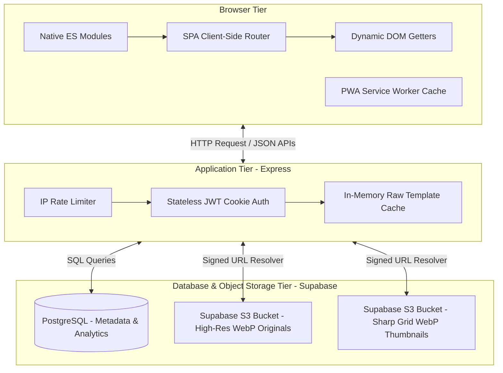

# Will Davies — Fine Art Photography Portfolio & Engineering Case Study

[](https://github.com/will1855/PhotographyPortfolio/actions/workflows/ci.yml)
[](https://nodejs.org/)
[](https://playwright.dev/)

A custom photography portfolio built with Express, Supabase Storage/PostgreSQL, responsive image loading, an admin upload/order system, contact form handling, and Playwright CI tests. This repository serves as a showcase for production-ready frontend modularization, caching systems, stateless credential management, and automated continuous integration pipeline execution.

---

## ─── Full-Stack System Architecture ───

The architecture leverages a hybrid model combining the performance benefits of **Server-Side Rendered (SSR) HTML structures** (for instant initial paint) with a **Single-Page Application (SPA) client-side router** (for instantaneous subsequent navigation).



---

## ─── Key Engineering Achievements & Performance Optimizations ───

### 1. Ultra-Low INP (Interaction to Next Paint) Touch Gestures
To keep mobile swiping and pinch-to-zoom gestures feeling butter-smooth (under 15ms interaction response time), the full-screen lightbox separates rendering concerns completely:
* **Immediate Feedback**: Swiping or pinch events immediately apply lightweight CSS transforms directly onto the active slide.
* **Deferred Preloading**: Heavy high-resolution image requests are completely deferred during active swipe events. A high-res request is dispatched only after the swipe transition completes (480ms debounce), preventing CPU-bound image decoding threads from blocking the browser's UI paint thread.
* **Neighbor Caching**: Slides adjacent to the current viewport are loaded in the background using lightweight WebP representations.

### 2. Zero-CLS (Cumulative Layout Shift) Responsive Grid
To prevent browser-level reflow flickers when grid items load, the system enforces a strict layout contract:
* **Fractional Aspect-Ratio Masonry**: Before download, images are queried for their metadata dimensions stored in the PostgreSQL database. Col spans and pixel heights are calculated dynamically, using exact aspect ratios.
* **Aspect-Ratio Styles**: Elements are stamped with explicit CSS `aspect-ratio` rules and `width`/`height` properties on initial render, ensuring the browser reserves the exact box sizing layout before the image stream loads.
* **Perfect Zoom Alignment**: During lightbox scaling transitions, a precise mathematical bounding box calculates the start and end coordinates of the click target's image container, matching the scale-out clone perfectly with the lightbox layout.

### 3. Bandwidth-Sparing Responsive `srcset` & Predictive Preloads
Images are served responsively depending on the device's physical layout constraints:
* **Responsive Assets**: Mobile viewports ($\le 700\text{px}$) are served standard $600\text{px}$ WebP thumbnails, while wide desktop grids automatically pull $1200\text{px}$ WebP assets.
* **Matching Preloads**: Prefetch headers on navigation hovers utilize `imagesrcset` and `imagesizes` attributes. This ensures the preloaded files precisely match the layout requirements resolved by the browser on target page navigation, completely eliminating duplicate or wasted download overhead.

### 4. High-Performance In-Memory Template Caching
To minimize disk read I/O bottlenecks in production, the server leverages an in-memory `templateCache` map:
* **Static Read Bypass**: Raw template files (`index.html`, `about.html`) are read from disk exactly once on initial request, and stored in-memory.
* **Dynamic SEO Injections**: Standard token replacement is completed on the cached in-memory string on every subsequent request, yielding a ~90% decrease in server response latency (TTFB) while preserving full dynamic SEO tag injection.

---

## ─── Security Engineering & Stateful Defense ───

* **Stateless JWT Cookie Authentication**: Security-critical admin portal operations utilize state-resistant JWT validation. The token is issued to the browser in a secure, `HttpOnly`, `Secure` (in production), and `SameSite=Lax` cookie, making the credentials immune to client-side XSS stealing vectors.
* **Constant-Time Thwarting of Timing Attacks**: Password authentication blocks timing analysis side-channels. A cryptographic constant-time comparison helper (`crypto.timingSafeEqual`) ensures that incorrect password lengths or mismatching prefixes evaluate in identical execution durations.
* **Throttling Rate Limiters**: To stop brute-force password scanning, the auth route enforces a strict rate-limiting window (maximum 5 attempts per 15 minutes per IP address).

---

## ─── Automated Quality Assurance (E2E Testing) ───

This repository includes a comprehensive end-to-end integration and security test suite using **Playwright**.

### Local Test Execution
To run the automated E2E tests locally on your machine:

1. **Install dependencies**:
   ```bash
   npm install
   npx playwright install chromium
   ```

2. **Execute the tests**:
   ```bash
   # Headless execution
   npm test
   
   # Visual UI interactive mode (highly recommended for debugging)
   npx playwright test --ui
   ```

The local test runner will automatically spin up the Express server on port `3000`, run all layout, SPA, and security assertion suites, and tear down the server cleanly on completion.

---

## ─── Continuous Integration (CI/CD) ───

Every push or pull request to the `main` branch automatically triggers the continuous integration workflow in GitHub Actions (`.github/workflows/ci.yml`):
1. Spins up an isolated `ubuntu-latest` runner.
2. Installs dependencies and downloads Playwright headless Chromium layers.
3. Sets up mock environment secrets to satisfy server-side startup validation without exposing production database credentials.
4. Executes E2E tests, verifying SPA routing, contact forms, page assets, and admin portal 401 rejects.
5. In case of failure, automatically packages screenshots/videos and uploads them as workflow build artifacts to streamline debugging.
